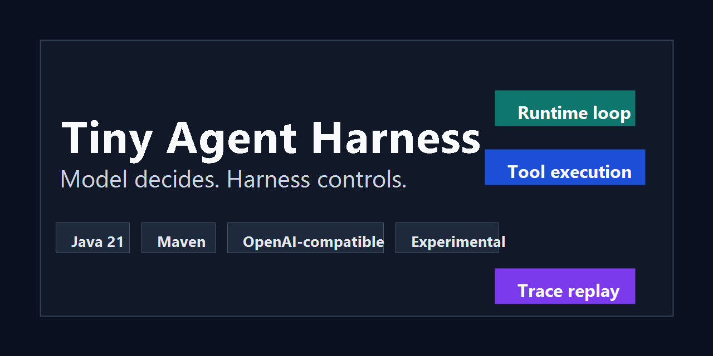
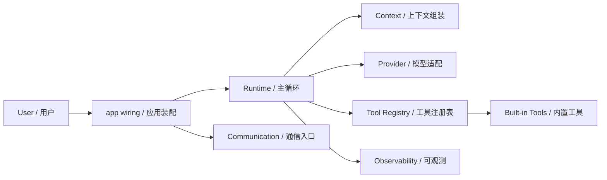

# Tiny Agent Harness

> A small Java Agent Harness for studying controlled AI runtime execution.
>
> 一个用于学习和验证可控 AI Agent 运行时边界的 Java 项目。




Tiny Agent Harness keeps the model responsible for decisions, while the harness owns the loop, tool execution, context boundaries, safety checks, and observability.

Tiny Agent Harness 的核心边界很明确：模型负责决策，Harness 负责主循环、工具执行、上下文约束、安全拦截和可观测回放。

## What is Tiny Agent Harness? / Tiny Agent Harness 是什么？

Tiny Agent Harness is a compact, inspectable Java implementation of an Agent runtime. It is designed for developers who want to understand how an AI Agent loop works without hiding the runtime behind a large framework.

Tiny Agent Harness 是一个小而清晰的 Java Agent 运行时实现，适合用于学习、实验和验证 Agent Harness 的关键边界，而不是把控制流藏进黑盒框架。

The project currently includes:

项目当前包含：

- A runtime loop for finish, tool, parallel-tool, and optional thinking decisions.
- 支持最终回答、单工具、并行工具和可选 Thinking 阶段的运行时主循环。
- OpenAI-compatible model providers, with LM Studio as the default CLI and Telegram wiring.
- OpenAI-compatible 模型适配，CLI 和 Telegram 默认装配 LM Studio。
- A minimal tool registry with `read_file`, `write_file`, `edit_file`, `bash`, and `spawn_subagent`.
- 极简工具注册表：`read_file`、`write_file`、`edit_file`、`bash`、`spawn_subagent`。
- Project context loading from `AGENTS.md` and skill summaries from `.tinyclaw/skills/**/SKILL.md`.
- 从 `AGENTS.md` 加载项目约束，并扫描 `.tinyclaw/skills/**/SKILL.md` 的技能摘要。
- Optional Plan Mode state under `.tinyclaw/state/.../PLAN.md` and `TODO.md`.
- 可选 Plan Mode，把长程任务状态外部化到 `.tinyclaw/state/.../PLAN.md` 和 `TODO.md`。
- Telegram Webhook support with session memory, intent filtering, and tool approval.
- Telegram Webhook 支持会话记忆、触发词过滤和工具审批。
- Benchmark and trace output for repeatable evaluation.
- Benchmark 与 JSON trace 输出，便于复盘和评估。

## Why this project? / 为什么需要它？

Most Agent examples focus on the model prompt or tool list. Tiny Agent Harness focuses on the runtime contract: who controls the loop, where context is assembled, how tools are routed, what can be audited, and how failures are surfaced.

很多 Agent 示例只关注提示词和工具列表。Tiny Agent Harness 更关注运行时契约：谁控制主循环、上下文在哪里组装、工具如何路由、哪些动作可以审计、失败如何收口。

It is intentionally small:

它刻意保持小而直接：

- Use it to learn the moving parts of an Agent runtime.
- 可用于学习 Agent Runtime 的关键组成。
- Use it to test provider, context, tool, and communication boundaries.
- 可用于验证 Provider、Context、Tool、Communication 等边界。
- Use it as a reference when designing a more controlled internal Agent harness.
- 可作为设计内部可控 Agent Harness 的参考。

This is an experimental project, not a production Agent platform.

这是一个实验项目，不是生产级 Agent 平台。

## Core Capabilities / 核心能力

| Area | English | 中文 |
| --- | --- | --- |
| Runtime | Owns the main loop, tool execution order, failure handling, and metrics. | 负责主循环、工具执行顺序、失败处理和指标。 |
| Provider | Adapts OpenAI-compatible chat completions into internal decisions. | 将 OpenAI-compatible Chat Completions 映射为内部决策。 |
| Context | Builds the system prompt from core rules, workspace constraints, `AGENTS.md`, and skill summaries. | 从核心规则、工作区约束、`AGENTS.md` 和技能摘要组装 System Prompt。 |
| Tool Registry | Registers tools, exposes schemas, routes execution, and applies middleware. | 注册工具、暴露工具定义、路由执行并应用 Middleware。 |
| Communication | Converts external chat messages into Agent tasks, including Telegram Webhook integration. | 将外部聊天消息转换为 Agent 任务，包括 Telegram Webhook 接入。 |
| Observability | Writes readable logs, run metrics, final results, and JSON traces. | 输出可读日志、运行指标、最终结果和 JSON trace。 |

## Architecture / 架构边界

The guiding principle is simple: the model decides, the harness controls.

核心原则很简单：模型决策，Harness 控制。



Layer responsibilities follow [`docs/agent-harness-principles.md`](docs/agent-harness-principles.md):

分层职责遵循 [`docs/agent-harness-principles.md`](docs/agent-harness-principles.md)：

- `Runtime`: main loop and runtime control.
- `Runtime`：主循环与运行时控制。
- `Provider`: model protocol adaptation only.
- `Provider`：只负责模型协议适配。
- `Context`: system prompt and workspace context composition.
- `Context`：负责 System Prompt 与工作区上下文组装。
- `Tool Registry`: tool declaration, lookup, routing, and middleware.
- `Tool Registry`：负责工具声明、查找、路由和 Middleware。
- `Communication`: external message ingress, session output, and approval flow.
- `Communication`：负责外部消息入口、会话输出和审批流。
- `Observability`: logs, metrics, result summaries, and replay traces.
- `Observability`：负责日志、指标、结果摘要和可回放 trace。

## Project Layout / 项目结构

```text
src/main/java/io/github/tinyclaw/agent
  app/             CLI entry and application wiring
  benchmark/       benchmark cases, runner, and report writer
  communication/   chat abstraction, Telegram Webhook, approval flow
  context/         system prompt composition, AGENTS.md, skill summaries
  domain/          Task, Decision, ToolCall, AgentContext data model
  observability/   local JSON trace recording
  provider/        OpenAI-compatible model provider implementations
  runtime/         AgentEngine, RunLogger, RunResult, memory, compaction, metrics
  tool/            tool interface, registry, built-in tools, permissions

src/test/java/io/github/tinyclaw/agent
  app/ architecture/ benchmark/ communication/ context/ observability/ provider/ runtime/ tool/

docs/
  design notes and architecture constraints
```

## Requirements / 环境要求

- JDK 21
- Maven 3.9+

Check your shell before running Maven:

运行 Maven 前先确认当前 shell 使用 Java 21：

```sh
java -version
mvn -version
```

## Quick Start / 快速开始

Create `agent.properties` in the project root. You can copy values from `src/main/resources/agent.properties.example`.

在项目根目录创建 `agent.properties`，可参考 `src/main/resources/agent.properties.example`。

Example for LM Studio:

LM Studio 示例：

```properties
lmstudio.baseUrl=http://localhost:1234/v1
lmstudio.model=your-local-model
```

Compile and test:

编译和测试：

```sh
mvn -q -DskipTests compile
mvn test
```

When passing Maven system properties in PowerShell, keep each `-D...` value as a complete argument:

在 PowerShell 中传递 Maven 系统属性时，确保每个 `-D...` 是完整参数：

```sh
mvn "-Dtest=AgentApplicationTest" test
```

## CLI Usage / CLI 使用

The supported entrypoints are `run`, `telegram`, and `bench`.

当前正式入口是 `run`、`telegram` 和 `bench`。

Run a single prompt:

执行一次 prompt：

```sh
mvn exec:java -Dexec.args="run --prompt <prompt>"
```

Run with provider debug summaries:

开启 Provider debug 摘要：

```sh
mvn exec:java -Dexec.args="run --debug --prompt <prompt>"
```

Run with two-phase thinking:

开启两阶段 Thinking：

```sh
mvn exec:java -Dexec.args="run --thinking --prompt <prompt>"
```

Run with Plan Mode:

开启 Plan Mode：

```sh
mvn exec:java -Dexec.args="run --plan --prompt <prompt>"
```

CLI `run` prints `METRICS` at the end, including model calls, token usage, model time, tool calls, and tool time. CLI Plan Mode stores state under `.tinyclaw/state/cli/default/`.

CLI `run` 结束时输出 `METRICS`，包含模型调用、Token、模型耗时、工具调用和工具耗时。CLI Plan Mode 状态目录为 `.tinyclaw/state/cli/default/`。

Example: prepare a small Java concurrency counter workspace, then let the Agent explore, fix, and validate it:

示例：准备一个 Java 并发计数器靶场，让 Agent 自行探索、修复并验证：

```powershell
powershell -ExecutionPolicy Bypass -File scripts\prepare-concurrency-counter-workspace.ps1
mvn exec:java "-Dexec.args=run --thinking --plan --prompt 请在 target/concurrency-counter-workspace 中自行探索，找到并发安全问题，分析原因，修复并执行正确性验证。"
Set-Location target\concurrency-counter-workspace
powershell -File .\validation.ps1
```

> 主循环按 `FinishDecision` 结束；`ToolDecision` 和 `ParallelToolDecision` 继续执行工具调用，Harness 仅保留系统提醒，不做硬性停机阈值。

Do not rely only on the final answer. Check `RESULT`, `OBSERVATIONS`, `METRICS`, `.tinyclaw/traces/trace-*.json`, the validation output, and the actual files in the workspace.

不要只看最终回答；同时检查 `RESULT`、`OBSERVATIONS`、`METRICS`、`.tinyclaw/traces/trace-*.json`、验证命令输出和工作区真实文件改动。

## Benchmark / 基准验证

Run the built-in benchmark:

执行内置 Benchmark：

```sh
mvn exec:java -Dexec.args="bench"
```

The benchmark creates isolated workspaces under `.tinyclaw/bench/workspaces/...`, runs the Agent, executes validation commands, and writes JSON reports to `.tinyclaw/bench/reports/`.

Benchmark 会在 `.tinyclaw/bench/workspaces/...` 下创建独立靶场，运行 Agent 后执行验证命令，并把 JSON 报告写入 `.tinyclaw/bench/reports/`。

Reports include success rate, token usage, model time, tool time, tool failures, and completion steps.

报告包含成功率、Token、模型耗时、工具耗时、工具失败次数和完成轮数。

## Telegram Webhook / Telegram Webhook

Start the Telegram Webhook:

启动 Telegram Webhook：

```sh
mvn exec:java -Dexec.args="telegram"
```

Common `agent.properties` settings:

常用 `agent.properties` 配置：

```properties
agent.workdir=.
agent.enableThinking=false
agent.planMode=false
agent.debug=false
agent.intentFilter.enabled=true
agent.intentFilter.marker.1=/agent
agent.intentFilter.marker.2=@机器人
agent.intentFilter.marker.3=排查
agent.intentFilter.marker.4=修复
agent.intentFilter.marker.5=nginx
agent.intentFilter.marker.6=执行
agent.workingMemory.maxMessages=12
agent.workingMemory.maxChars=12000
agent.permissions.enabled=false
agent.permissions.file=.tinyclaw/permissions.yaml

telegram.bot.token=your-telegram-bot-token
telegram.webhook.host=127.0.0.1
telegram.webhook.port=8080
telegram.webhook.path=/telegram/webhook
telegram.webhook.tunnel=trycloudflare
telegram.webhook.url=
telegram.webhook.secret=your-random-secret
```

Telegram behavior:

Telegram 行为：

- `telegram --debug` enables provider debug summaries for the current long-running process.
- `telegram --debug` 为本次长驻进程开启 Provider debug 摘要。
- If `telegram.webhook.url` is empty and `telegram.webhook.tunnel=trycloudflare`, the app starts a trycloudflare tunnel and registers the dynamic HTTPS URL.
- 当 `telegram.webhook.url` 为空且 `telegram.webhook.tunnel=trycloudflare` 时，会启动 trycloudflare 隧道并注册动态 HTTPS URL。
- Each `chatId` keeps isolated in-process working memory.
- 每个 `chatId` 保留隔离的进程内 Working Memory。
- `/usage` returns accumulated model and tool metrics for the current chat.
- `/usage` 返回当前会话累计模型与工具指标。
- With `agent.intentFilter.enabled=true`, group messages wake the Agent only when configured markers are present.
- 开启 `agent.intentFilter.enabled=true` 后，群聊消息只有命中配置触发词才会唤醒 Agent。
- With `agent.planMode=true`, each chat stores state under `.tinyclaw/state/chat/<chatId>/`.
- 开启 `agent.planMode=true` 后，每个 chat 使用 `.tinyclaw/state/chat/<chatId>/`。
- With `agent.permissions.enabled=true`, `ask` rules wait for `/approve <id>` or `/reject <id>`.
- 开启 `agent.permissions.enabled=true` 后，`ask` 规则会等待 `/approve <id>` 或 `/reject <id>`。

Minimal permission file:

最小权限文件示例：

```yaml
version: 1
enabled: true
defaultAction: ask
approvalTimeoutSeconds: 1800

rules:
  - id: allow-read
    tools: [read_file]
    action: allow

  - id: deny-dangerous-bash
    tools: [bash]
    action: deny
    arguments:
      command:
        regex: "(?i)\\b(rm\\s+-rf|sudo\\b|drop\\s+(database|table)|kubectl\\s+delete)\\b"

  - id: ask-write-tools
    tools: [write_file, edit_file, bash]
    action: ask
```

## AgentOps nginx Demo / AgentOps nginx 演示

The repository includes a local Telegram AgentOps demo that uses Docker to simulate an nginx incident workspace:

仓库包含一个 Telegram AgentOps 本地演示，用 Docker 模拟 nginx 故障现场：

```sh
powershell -File scripts/verify-agentops-nginx-smoke.ps1
```

The script checks Docker, starts `examples/agentops-nginx-docker`, and explains how to point `agent.workdir` to `examples/agentops-nginx-workspace`.

脚本会检查 Docker、启动 `examples/agentops-nginx-docker`，并说明如何把 `agent.workdir` 指向 `examples/agentops-nginx-workspace`。

Recommended local validation commands run through the container:

建议本地通过容器执行验证：

```sh
docker exec tinyclaw-agentops-nginx nginx -t -c /workspace/nginx.conf
docker exec tinyclaw-agentops-nginx nginx -s reload
```

Then send this in Telegram:

然后在 Telegram 中发送：

```text
/agent 帮我排查 nginx 起不来并尝试修复
```

Configuration edits and `nginx -s reload` can be gated by `.tinyclaw/permissions.yaml`, and execution replay is written under `.tinyclaw/traces/`.

配置修改和 `nginx -s reload` 可通过 `.tinyclaw/permissions.yaml` 审批拦截，执行回放写入 `.tinyclaw/traces/`。

## Providers / Provider

Two OpenAI-compatible providers are currently available:

当前已有两个 OpenAI-compatible Provider：

- `LmStudioModelProvider`: default wiring for CLI and Telegram; reads `lmstudio.baseUrl` and `lmstudio.model`.
- `LmStudioModelProvider`：CLI 和 Telegram 默认装配，读取 `lmstudio.baseUrl` 与 `lmstudio.model`。
- `SiliconFlowModelProvider`: reads `siliconflow.apiKey`, `siliconflow.baseUrl`, and `siliconflow.model`; covered by tests, but not exposed as a direct CLI switch.
- `SiliconFlowModelProvider`：读取 `siliconflow.apiKey`、`siliconflow.baseUrl` 与 `siliconflow.model`；已有测试覆盖，但当前没有 CLI 参数直接切换默认装配。

LM Studio live test:

LM Studio live 测试：

```sh
mvn "-Dlmstudio.live=true" "-Dtest=LmStudioModelProviderLiveTest" test
```

SiliconFlow live test:

SiliconFlow live 测试：

```sh
mvn "-Dsiliconflow.live=true" "-Dtest=SiliconFlowModelProviderLiveTest" test
```

## Safety and Observability / 安全与可观测

Tiny Agent Harness keeps high-risk behavior explicit:

Tiny Agent Harness 保持高风险行为显式化：

- Tools validate their own arguments and workspace boundaries.
- 工具自身校验参数和工作区边界。
- `ToolRegistry` wraps unknown tools and tool exceptions into unified failure results.
- `ToolRegistry` 将未知工具和工具异常包装为统一失败结果。
- Optional Telegram approval middleware can allow, ask, or deny tool calls based on `.tinyclaw/permissions.yaml`.
- 可选 Telegram 审批 Middleware 可按 `.tinyclaw/permissions.yaml` 对工具调用执行 allow、ask 或 deny。
- `AgentEngine` runs read-only tool calls in parallel where safe and serializes side-effecting calls.
- `AgentEngine` 对只读工具调用做安全并发，对有副作用工具串行执行。
- `RunLogger`, `RunResult`, `RunMetrics`, and `TraceRecorder` provide readable logs, final results, metrics, and JSON replay traces.
- `RunLogger`、`RunResult`、`RunMetrics`、`TraceRecorder` 分别提供可读日志、最终结果、指标和 JSON 回放 trace。

## Documentation / 文档

- [Agent Harness Principles](docs/agent-harness-principles.md)
- [Main Loop Plan](docs/main-loop-plan.md)
- [Provider Design](docs/provider-design.md)
- [Tool Registry Design](docs/tool-registry-design.md)
- [Communication Service Design](docs/communication-service-design.md)
- [Telegram Webhook Principles](docs/telegram-webhook-principles.md)
- [State Externalization Design](docs/state-externalization-design.md)
- [Context Compaction Design](docs/context-compaction-design.md)

## License / 许可证

Apache License 2.0. See [LICENSE](LICENSE).

Apache License 2.0。详见 [LICENSE](LICENSE)。
