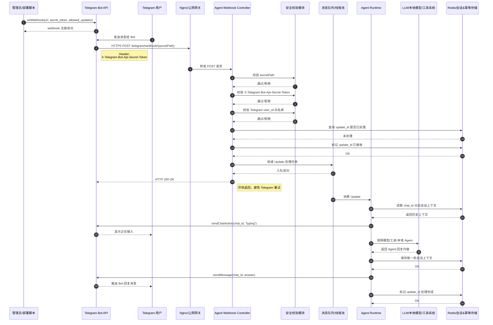

# Telegram Webhook 工作原理

## 核心机制

Telegram Bot 有两种常见收消息方式：

- Long polling：服务端反复调用 `getUpdates` 拉取消息。
- Webhook：服务端先调用 `setWebhook` 注册一个 HTTPS 回调地址，之后 Telegram Bot API 在收到用户消息后主动把 update 推送到这个地址。

Webhook 的关键点是“先注册，再被动接收”。Bot API 保存回调 URL、可选 `secret_token` 和 `allowed_updates`；用户给 Bot 发消息后，Telegram 把消息包装成 update，通过 HTTPS POST 推到业务服务。业务服务应尽快返回 HTTP 200，避免 Telegram 认为投递失败后重试。

## 生产级推荐模型

下面的时序图展示一个偏生产化的完整模型：公网网关负责 HTTPS 入口，Webhook 层做多重安全校验，Redis 做幂等和会话存储，队列或线程池负责异步处理，Agent Runtime 再调用模型和工具系统生成回复。



## 本项目实现映射

本项目当前是轻量实现，目标是验证 Telegram Webhook 到 Agent Main Loop 的闭环，不引入复杂持久化和独立服务编排。

| 生产模型角色 | 本项目对应实现 | 说明 |
| --- | --- | --- |
| `setWebhook` 注册 | `TelegramWebhookRegistrar` | 调用 Telegram Bot API `setWebhook`，设置 `url`、`allowed_updates=["message"]`、`secret_token`、`drop_pending_updates`、`max_connections`。 |
| 公网 HTTPS 入口 | `telegram.webhook.url` 或 `telegram.webhook.tunnel=trycloudflare` | 生产可由 Nginx/网关转发；本地可用 trycloudflare 临时 HTTPS 地址。 |
| Webhook Controller | `TelegramTransport` | 使用 JDK `HttpServer` 监听 `telegram.webhook.path`，接收 Telegram POST update。 |
| Secret token 校验 | `TelegramTransport` | 校验 `X-Telegram-Bot-Api-Secret-Token` 是否等于 `telegram.webhook.secret`。 |
| Update 解析 | `TelegramTransport` | 只处理文本消息，转换为 `ChatMessage(messageId, chatId, senderId, text)`；非文本 update 返回 200 并忽略。 |
| 轻量队列 | `WorkspaceSerialExecutor` | 单线程串行执行同一工作区的 Agent 任务，避免并发写工作区。 |
| Agent 调度 | `ChatAgentService` | 将消息转换为 `Task("chat-" + messageId, text)`，创建带聊天日志的 `AgentEngine` 并提交执行。 |
| Agent Runtime | `AgentEngine` | 推进 Main Loop，处理模型决策、工具调用和最终结果。 |
| LLM/工具系统 | `LmStudioModelProvider` + `ToolRegistry` | 默认宿主使用 LM Studio OpenAI-compatible Provider，并注册 `read_file`、`write_file`、`edit_file`、`bash`。 |
| 回复用户 | `TelegramSession` / `TelegramRunLogger` | 通过 Bot API `sendMessage` 回发状态、错误和最终回答。 |

## 当前真实消息流

```text
Telegram Bot API
  -> HTTPS 公网入口/trycloudflare
  -> TelegramTransport
  -> ChatMessage
  -> ChatAgentService
  -> WorkspaceSerialExecutor
  -> AgentEngine
  -> TelegramRunLogger / TelegramSession
  -> Telegram Bot API
  -> 用户
```

这个流程里，`TelegramTransport` 在调用 `ChatAgentService.handle(...)` 后返回 HTTP 200。`ChatAgentService` 会把实际 Agent 执行提交给 `WorkspaceSerialExecutor`，因此 Webhook 接收线程不直接运行完整 Main Loop。

## 配置入口

默认运行读取项目根目录 `agent.properties`；如果根目录不存在，则读取 classpath 中的 `agent.properties`。当前应用启动配置和 Webhook 宿主配置都只使用 properties key。

常用 properties key：

- `telegram.bot.token`：Bot Token，必填。
- `telegram.webhook.enabled`：无参数启动时是否进入 Telegram Webhook 服务，默认 `false`。
- `telegram.webhook.url`：公网 HTTPS Webhook URL；为空且未启用 trycloudflare 时只启动本地 server，不注册公网 Webhook。
- `telegram.webhook.secret`：可选 secret token，用于校验 Telegram 请求头。
- `telegram.webhook.host`：本地监听地址，默认 `0.0.0.0`。
- `telegram.webhook.port`：本地监听端口，默认 `8080`。
- `telegram.webhook.path`：本地 Webhook path，默认 `/telegram/webhook`。
- `telegram.webhook.tunnel`：设为 `trycloudflare` 时，本地启动临时公网 HTTPS 隧道。
- `telegram.webhook.dropPendingUpdates`：注册 Webhook 时是否丢弃积压 update，默认 `false`。
- `telegram.webhook.maxConnections`：传给 `setWebhook.max_connections`，默认 `40`。
- `telegram.webhook.registrationDelaySeconds`：trycloudflare 动态 URL 注册前延迟秒数，默认 `60`。
- `telegram.webhook.registrationMaxAttempts`：`setWebhook` 最大尝试次数（含首次），默认 `3`。
- `telegram.webhook.registrationRetryIntervalSeconds`：`setWebhook` 重试间隔秒数，默认 `20`。
- `agent.workdir`：Webhook 模式 Agent 工作目录，默认 `.`。
- `agent.maxSteps`：Webhook 模式 Agent 最大步数，默认 `8`。
- `agent.enableThinking`：Webhook 模式是否开启 Thinking，默认 `false`。

## 当前未实现项

这些能力属于生产增强方向，当前代码没有实现：

- 无 Redis 或数据库持久化。
- 无 `update_id` 幂等存储。
- 无 `chat_id` 级长期会话上下文存储。
- 无 Telegram `user_id` 白名单。
- 无 URL `secretPath` 独立校验；当前依赖固定 path 和 `secret_token`。
- 无 `sendChatAction(chat_id, "typing")`。
- 无独立消息队列、工作流引擎或分布式消费。

如果后续要走生产化，优先补 `update_id` 幂等、用户白名单、会话存储和快速 ACK 边界，再考虑 Redis/队列等基础设施。
